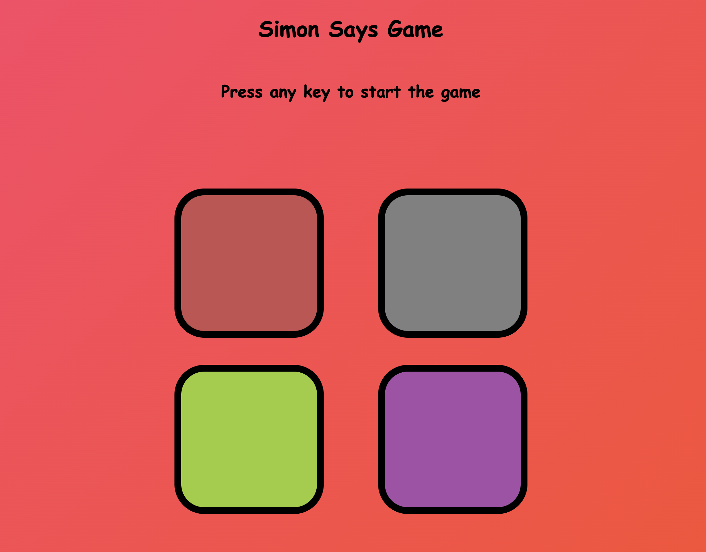

# Simon
Remember As Long As You Can

### [Play the Game](https://whereissimon.netlify.app/)

  

----
## How to Play Simon Game

### Instructions

1. **Start the Game**:
   - Click "Start" to begin.

2. **Watch the Sequence**:
   - The game shows a color sequence with sounds.

3. **Repeat the Sequence**:
   - Click the buttons in the same order.

4. **Advance**:
   - Each correct repetition adds another color to the sequence.
   - Continue to the next round if correct, or start over if wrong.

### Tips

- **Focus on the Sequence**:
  - Pay close attention to the order of colors and sounds.

- **Practice**:
  - The more you play, the better your memory gets.

### Example

- **Round 1**: Shows [Green]. Click [Green].
- **Round 2**: Shows [Green, Red]. Click [Green, Red].
- **Round 3**: Shows [Green, Red, Yellow]. Click [Green, Red, Yellow].
